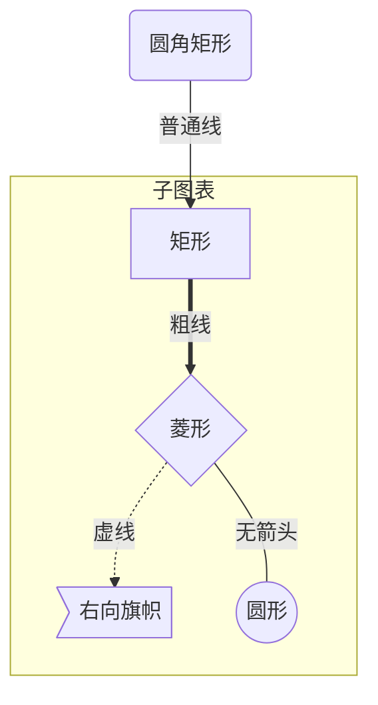
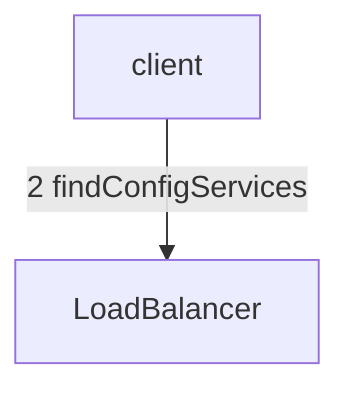
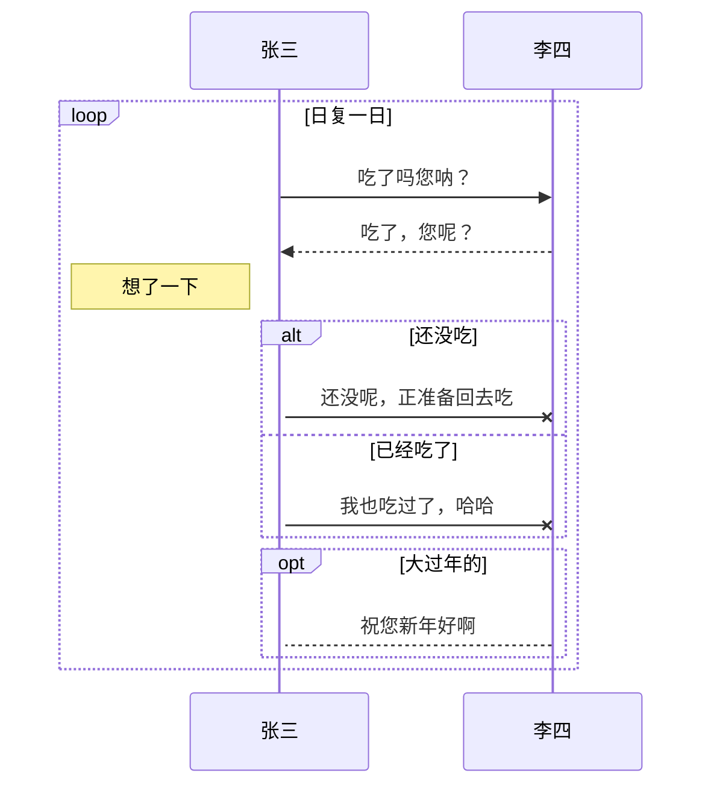

# test
## title2
### title3
___
这是一段**加粗**的文字，这也是 __加粗__ 文字，这是 _倾斜_ 文字
>注释文字
>> 注释二层
>>>注释三层
>>>>>注释五层

```C
#include<iostream>
void main(){
    cout<<123<<endl;
}
```
```javascript
console.log(666)
```
```python
def func():
    print('nihao')
```

+ 无序列表z
    - 世界
    - 上帝
        - 书店
            - 美食
        - 紧急
+ 无序列表j

+ 无续列表1
    - 你好
        - 啦啦啦
    - 你得得得
        
+ 无序列表2
- 无序列表3
- 无序列表4

1. 有序1
    + hell
    + o
    + 你好
3. 有序3
2. 有序2

1992\.3发生了一件奇怪的事。  
hello  
[baidu](http://www.qq.com)  
[google](http://google.com/ "googletitle")






